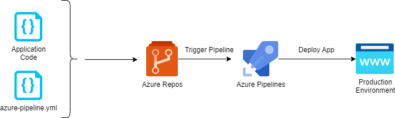

# Continuous Integration with `Azure Pipelines (Build)`

## Overview

- Azure Pipelines is a cloud-based solution by Microsoft that automatically builds and tests code projects.
- It supports all major languages and project types.
- Azure Pipelines combines continuous integration (CI) and continuous delivery (CD) to test, build, and deliver code to any destination.
- It also offers an efficient and secure way to automate builds and make them available to end-users.
- Azure Pipeline Agents are broadly categorized into two types:
  1. [Microsoft hosted agents](https://learn.microsoft.com/en-us/azure/devops/pipelines/agents/hosted)
  2. [Self-hosted agents](https://learn.microsoft.com/en-us/azure/devops/pipelines/agents/linux-agent)

## How Azure Pipeline (Build) works?

There are two main options for operating Azure Pipelines:

1. Define pipelines using YAML code (azure-pipeline.yml)
2. Classic GUI option

### 1. Define Pipelines Using YAML Syntax

- Azure Pipelines provides a YAML configuration called `azure-pipelines.yml`, which allows you to define your pipeline as code.
- The process works as follows:
  1. You write a simple YAML configuration file that specifies the structure of your pipeline.
  2. The pipeline YAML is versioned with your code. This means any changes to it can be managed via pull requests and build policies.
  3. Any changes to the pipeline configuration can break the process or have unexpected side-effects. When the pipeline is managed as code, you can easily identify the change that caused a problem and revert or resolve it.
- To work with pipelines as YAML code, you'll need to:
  1. Configure Azure Pipelines to point to your Git repo
  2. Define your build process using azure-pipelines.yml
  3. Push the YAML code to your version control repository (Azure Repos). This will trigger automatic build and deploy, and you can monitor results.

### 2. Define Pipelines Using the Classic Interface

- Azure Pipelines also provides a UI that lets you define pipelines manually.
- You can specify how the pipeline should build and test your code, and a release pipeline that defines how artifacts generated by the build process should be deployed to a target environment.
- To work with pipelines via the UI, follow these steps:
  1. Configure Azure Pipelines to point to your Git repo.
  2. Use the classic editor to configure a build pipeline and release pipeline for your project.
  3. Push code to version control repository. This will trigger the pipeline, run build and test steps, and then move artifacts into the release process.

## Hands-on Labs:

### Step-01: Check-in the Application code in Azure Repos

- Develop the `application code` on your local system, compile it and commit the changes locally on a feature branch.
- Check-in (push) the code into Azure repos.

### Step-02: Create an Azure build Pipeline and trigger it manually

- Create an `azure-pipeline.yml` configuration file with build specs and tasks.
- Commit the `azure-pipeline.yml` file in Azure Repos repository.
- Run the Azure Pipeline manually in order to check if the Pipeline executes all the build tasks correctly or not.

### Step-03: Automatically trigger Azure Build Pipeline

- In azure-pipeline.yml config file, you will find a trigger attribute (eg. main branch) which defines the criteria for triggering the build pipeline.
- Check-in the code on your Azure Repos repository's same branch as mentioned in your azure-pipeline.yml config file.
- It should result in automatic trigger of build pipeline.
